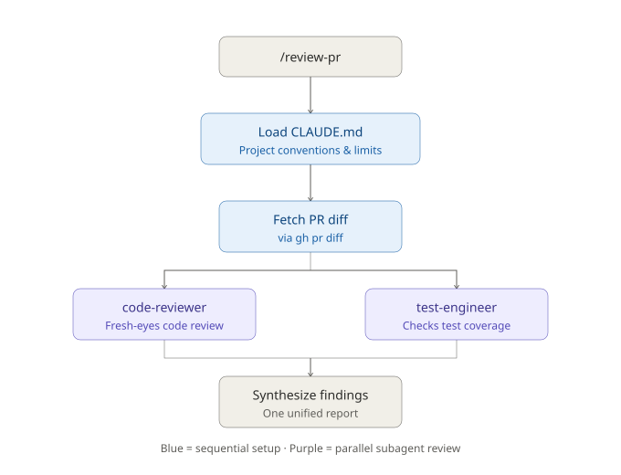

# Automated Code-Review Pipeline

## What this is

`/review-pr <number>` automatically reviews a GitHub pull request by
combining four separate tools built earlier in this course into one
command:

1. Loads CLAUDE.md so the review understands this project's specific
   context and known limitations.
2. Fetches the PR's diff via `gh` (GitHub CLI).
3. Delegates to two subagents in parallel:
   - `code-reviewer` - fresh-eyes review of the actual changes
   - `test-engineer` - checks whether the changes are adequately tested
4. Synthesizes both reports into one summary, including any
   disagreements between the two reviews.

Two hooks run alongside this as ongoing safety nets: a `PostToolUse`
hook auto-runs `ruff` + `pytest` after every `.py` edit, and a
`git` pre-commit hook blocks any commit if tests are failing.

## Real test run

Ran against `expense-tracker`'s PR #1 - both subagents independently
flagged the same test coverage gap, and the code-reviewer correctly
distinguished a real (if low-priority) race condition from things
that only looked like bugs but matched the project's contemporaneous
style.